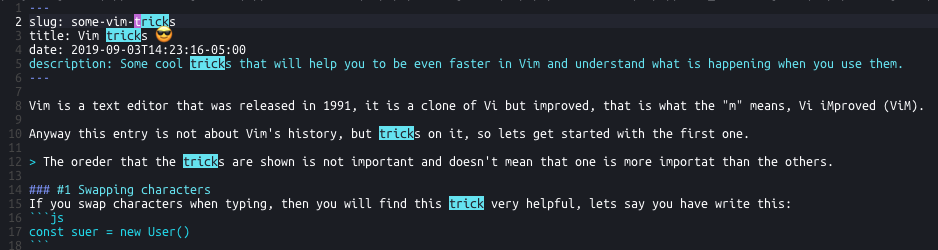

Vim is a text editor that was released in 1991, it is a clone of Vi but *improved*, that is what the "m" means, Vi iMproved (ViM).

Anyway this entry is not about Vim's history, but tricks on it, so let's get started with the first one.

> The oreder that the tricks are shown is not important and doesn't mean that one is more importat than the others.

### #1 Swapping characters
If you swap characters when typing, then you will find this trick very helpful, let's say you have write this:
```js
const suer = new User()
```
You have noticed that you have a `typo`, then you need to swap the `su` to be `us`.
You can achieve this by setting your cursor on the `s` and by pressing (in `COMMAND MODE`) `xp` you will get this:
```js
const user = new User()
```

##### Explanation
**`x`**: removes the character under the cursor and yanks it (You can understand this like `cut`).

**`p`**: inserts what you previously yanked after the character under the cursor.


### #2 Searching
This is really simple but worth to know.

If you have the need to find some word (or even `regexp`) you can type `/` (in `COMMAND MODE`) and search whatever you want.

As you do this, vim will highlight the matches, e.g.:

> In this case I typed `/trick`

### #3 Cleaning highlighted words
This is a easier one and complementary to the previous one.

Try `:noh`, it stops highlighting the word that was searched for.

### #4 Replacing in selected sections (and ranges)
Let's supose that we have the following code

```js
function sum(a, b)
  return a + b
end

sum(1, 4)
```

We want to refactor the name of the function from `sum` to `suma`.

It is really easy to achieve with `:%s/sum/suma/g`. After running that command we will have the following code:

```js
function suma(a, b)
  return a + b
end

suma(1, 4)
```

Easy, isn't it? But what would happen if we have more code that could match the `sum` keyword?

For that we can use `ranges`. The `%` in the command we executed was a range, it means all the file.
But we can choose a specific range typing `:1,5s/sum/suma/g`, it will only apply the command to the selected lines (1, 2, 3, 4 and 5).

If you have a range but there are some matches you would like to skip, just add `c` at the end of the command (`:1,5s/sum/suma/gc`),
this will let you choose which matches to replace and which to skip.

### #5 Sorting
Once you have learned *ranges* sorting will be easy for you.
It is the same idea than replacing but with thie `sort` command.

Let's sort the next numbers:
```sh
9999
1
34
f
67
345
4
```

We type `:1,7 sort` and we this:

```sh
1
34
345
4
67
9999
f
```

Super eas... wait, what? that's not sorted in the way we think, does it?
But don't worry, we can fix it easily by adding `n` at the end of the command (`:1,7 sort n`).

```sh
f
1
4
34
67
345
9999
```

Yes, we did it! In fact there are more things that we can do with sort:
- To sort in reverse order: `:%sort!`
- To sort and keep uniqueness: `:%sort u`


There are a lot of **Vim Tricks** to learn but for now that's it, I will be posting more about Vim but also about TMUX and useful things to do with your terminal.
