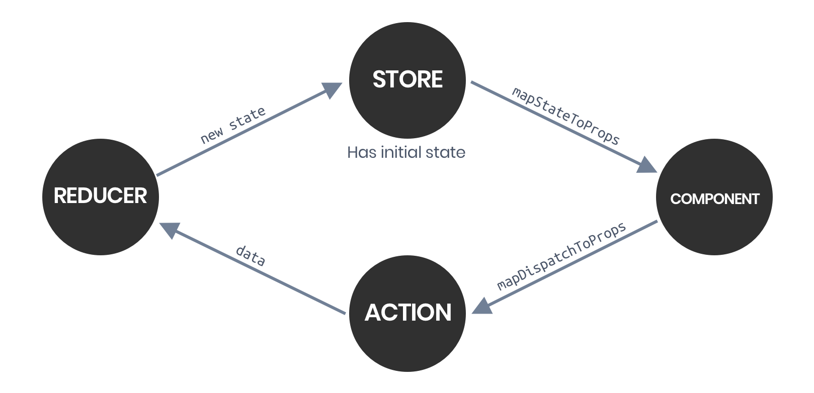

 
Redux is a *predictable* and *centralized* state container for JavaScript (not only React).
This means you can manage a global **state** in your app to have all the parts sharing the same information.

## What problems does Redux solve
If you have ever built a React, Vue or Angular app, you may have noticed that managing a state could become a mess.
Well, Redux is here to help, but it's not the only alternative. There more libraries like Redux, [Flux](https://facebook.github.io/flux/) is one of them.
So, let's talk about Flux and why devs use Redux.

## Why React devs use Redux instead of Flux
Flux and React are different by its nature. As Samer Buna said in he's [Medium post](https://medium.com/edge-coders/the-difference-between-flux-and-redux-71d31b118c1): "Flux is a pattern and Redux is a library.
Flux is a fancy name for the observer pattern modified a little bit to fit React"

Flux is the [Observer Patter](https://sourcemaking.com/design_patterns/observer) but just modified to fit Facebook's React needs.
This is ok, but how does Redux become in a better alternative to manage the state?


### Redux adventages over Flux
Redux is based on another libraries and is not based directly on a pattern, this allows Redux to be more flexible to fit on the React needs.

Libraries Redux is based on:
- Flux
- Elm
- Immutable
- Baobab
- RxJS

Redux tries to take the best of this to be more efficient and easy. It also tries to avoid common errors like modifying the state directly when we try to filter or do some process with our data.

## How does Redux work
Principles of Redux:
- Single source of truth.
- State is read-only.
- Changes are made with pure functions.

Then, what is the actual advantage, and what all those things mean.
And the most important question, how we can update the state if it is **read-only**?

### Single source of truth
This is very simple, you have one state for your entire application and it can be accessed from everywhere within the application.
> The state of your whole application is stored in an object tree within a single store.

> *Redux docs*.

### State is read-only
We will never change your state by mistake.
The **read-only** state can be only changed by an **action** that describes what is actually happening.

For example:

```javascript
store.dispatch({
  type: 'ADD_TASK',
  task: {
    name: 'Task name',
    date: new Date(),
  }
})
```

Here the action description is `'ADD_TASK'`, this points what's happening (adding a task, of course).
This action doesn't update our state, this is because that is the **reducer's** job.

### Changes are made with pure functions (Reducers)
Reducers are function that takes the current state and return the new state.
You can return whatever in a reducer, but remember not to modify the current state.

Example:
```javascript
const initialState = {
  tasks: [],
}

function tasks(state = initialState, action) {
  switch(action) {
    case 'ADD_TASK':
      return {
        ...state,
        tasks: [...state.tasks, action.task],
      }
    default:
      return state
  }
}
```

As you can see in the example above, we never mutated the `state`, but we *spread* it to recreate the whole state.
This is how reducers work, take an initial state, do your logic, and return a new state.

### Redux Workflow Diagram



##### Sources
- [Prior Art - Redux](https://redux.js.org/introduction/prior-art)
- [Observer Design Pattern](https://sourcemaking.com/design_patterns/observer)
- [The difference between Flux and Redux](https://medium.com/edge-coders/the-difference-between-flux-and-redux-71d31b118c1)
- [Three Principles - Redux](https://redux.js.org/introduction/three-principles)
